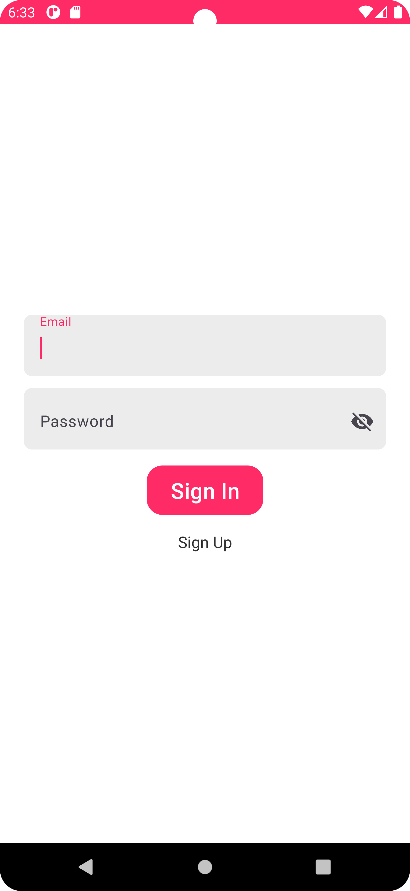
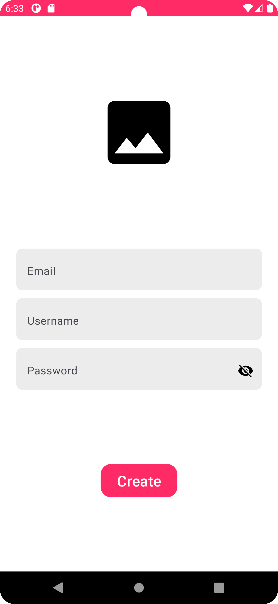
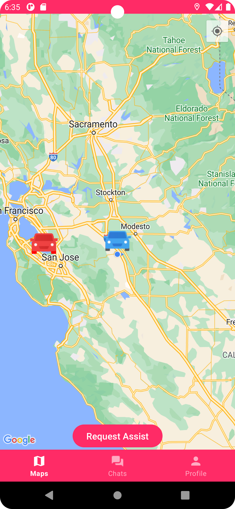
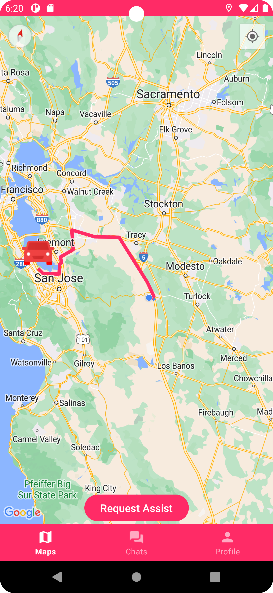
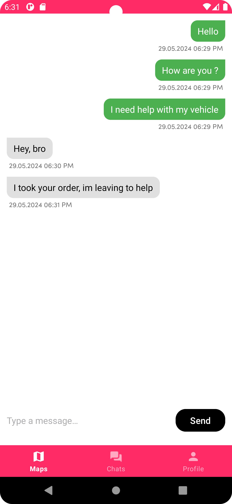
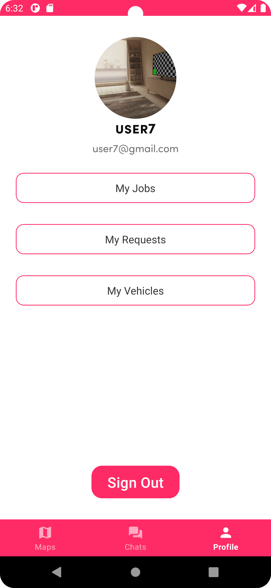
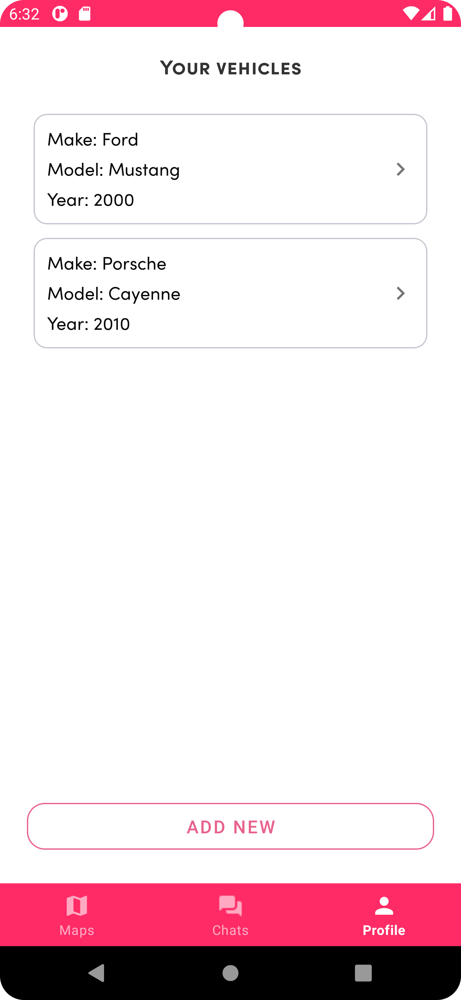

RoadAssist

Kotlin, Clean Architecture, MVVM, Coroutines, Hilt, Retrofit, Room, Google Maps API, Directions API, Firebase Auth, Firestore, Storage.

RoadAssist is a mobile application designed to enhance road safety and provide timely assistance during traffic incidents and emergencies. This app aims to bridge the gap between drivers, roadside assistance services, and emergency responders, ensuring quick and efficient help when it's needed the most.

Features
Global Coverage: RoadAssist works worldwide, offering reliable service regardless of your location.
Russian Language Support: The app is fully functional in Russia and supports the Russian language.
Free to Use: Unlike many similar applications, RoadAssist is available for free, removing the barrier of entry for all users.
User Messaging: Allows direct communication between drivers and assistance providers.
Intuitive Interface: Designed with user-friendliness in mind, ensuring ease of use during stressful situations.
Route Planning: Provides advanced routing capabilities, incorporating real-time traffic data and incident reports.

<table>
  <tr>
    <td style="text-align: center;"></td>
    <td style="text-align: center;"></td>
  </tr>
  <tr>
    <td style="text-align: center;"></td>
    <td style="text-align: center;"></td>
  </tr>
  <tr>
    <td style="text-align: center;"></td>
    <td style="text-align: center;"></td>
  </tr>
  <tr>
    <td style="text-align: center;"></td>
    <td style="text-align: center;"></td>
  </tr>
</table>
